# Job 06 - Application Docker multi-conteneurs

Ce projet met en place une petite application web composee de quatre services :

- `database` : MySQL 8.0 pour stocker les donnees.
- `backend` : API Node.js / Express qui interroge la base.
- `nginx` : serveur web qui sert le frontend et relaye les requetes API.
- `adminer` : interface web pour administrer la base de donnees.

L'objectif est de demarrer l'ensemble avec Docker Compose, de verifier le fonctionnement de l'API et de consulter la base de donnees depuis Adminer et depuis le terminal.

## Architecture et ports

- Frontend : [http://localhost:8088](http://localhost:8088)
- API backend : [http://localhost:3000](http://localhost:3000)
- Adminer : [http://localhost:8089](http://localhost:8089)

Le frontend appelle la route `/api/status`, qui est proxyee par Nginx vers le backend. Le backend execute ensuite une requete SQL simple pour confirmer que MySQL repond correctement.

## Prerequis

- Docker Desktop installe et demarre.
- Docker Compose disponible.
- Node.js installe si tu veux reconstruire le backend hors conteneur.

## Demarrage du projet

1. Se placer dans le dossier `job06`.
2. Initialiser le projet Node.js dans le dossier `backend`.
3. Installer les dependances du backend.
4. Lancer tous les conteneurs avec Docker Compose.
5. Verifier le frontend, l'API, Adminer et la base de donnees.

## Detail des captures

### 1. Initialisation du projet Node.js

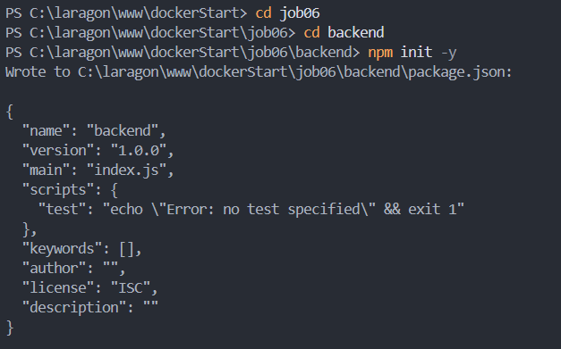

Commande utilisee :

```bash
npm init -y
```

Cette commande cree le fichier `package.json` du backend avec la configuration minimale. Elle sert de point de depart pour declarer les dependances et le script de lancement.

### 2. Installation des dependances

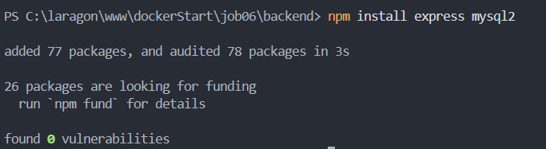

Commande utilisee :

```bash
npm install express mysql2
```

Cette etape installe les modules declares dans `package.json`, notamment `express` et `mysql2`. Elle prepare le backend pour pouvoir demarrer avec `npm start`.

### 3. Lancement de l'environnement Docker

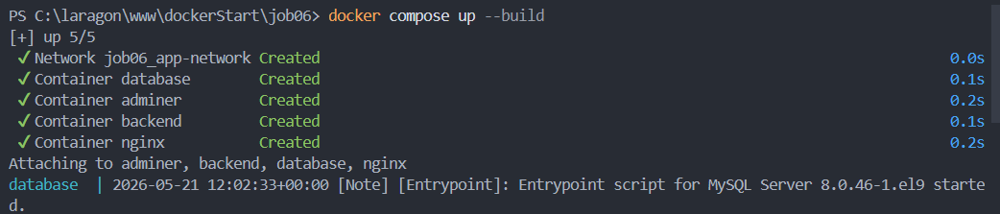

Commande utilisee :

```bash
docker compose up --build -d
```

Cette commande construit les images si necessaire, cree les conteneurs, puis lance toute la stack en arriere-plan. L'option `--build` garantit que les changements locaux sont bien pris en compte.

### 4. Connexion a la base avec Adminer

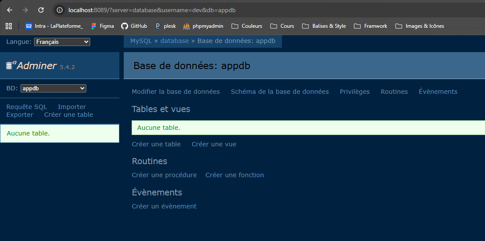

Action realisee : ouverture de l'interface Adminer dans le navigateur depuis http://localhost:8089/, puis connexion a MySQL.

Parametres typiques utilises :

- Serveur : `database`
- Utilisateur : `root`
- Mot de passe : `motdepasse`
- Base de donnees : `projetdb`

Cette capture montre la validation de l'acces a la base de donnees depuis un outil graphique.

### 5. Verification du backend

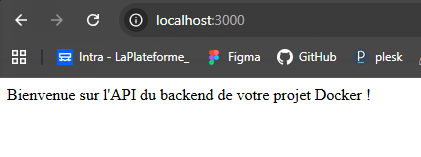

Action realisee : verification que le conteneur backend tourne correctement et qu'il affiche son message de demarrage.

Ce resultat confirme que :

- Node.js a bien demarre dans le conteneur.
- La connexion MySQL a pu etre etablie.
- Le serveur Express ecoute sur le port `3000`.

### 6. Verification du frontend

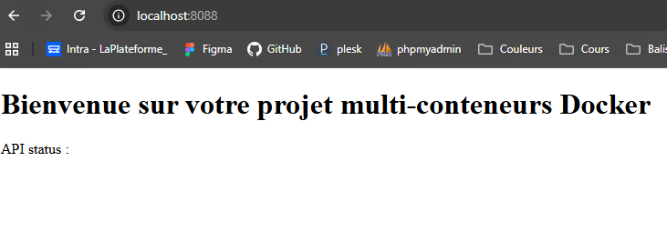

Action realisee : ouverture du frontend dans le navigateur via Nginx.

Cette page confirme que :

- Nginx sert correctement le fichier `index.html`.
- Le frontend est accessible sur le port `8088`.
- Le script JavaScript peut appeler l'API pour afficher le statut.

### 7. Test direct de l'API

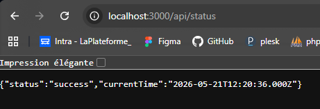

Commande ou action associee : appel direct de la route de test.

```bash
curl http://localhost:3000/api/status
```

Cette route renvoie un JSON contenant :

- `status` : indique que la requete a reussi.
- `currentTime` : date et heure retournees par MySQL via `SELECT NOW()`.

### 8. Verification des conteneurs actifs

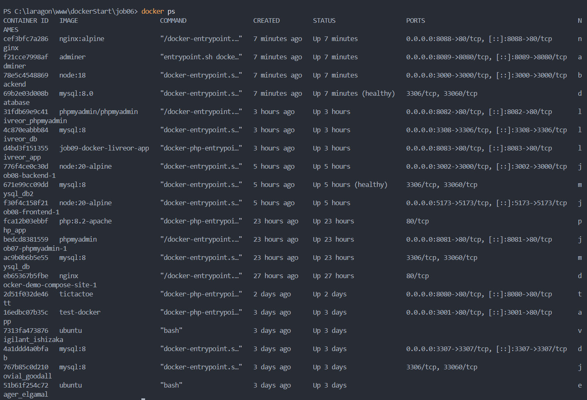

Commande utilisee :

```bash
docker ps
```

Cette commande affiche les conteneurs en cours d'execution, leurs ports exposes et leur etat. Elle permet de confirmer que `database`, `backend`, `nginx` et `adminer` sont bien actifs.

### 9. Verification de la base de donnees

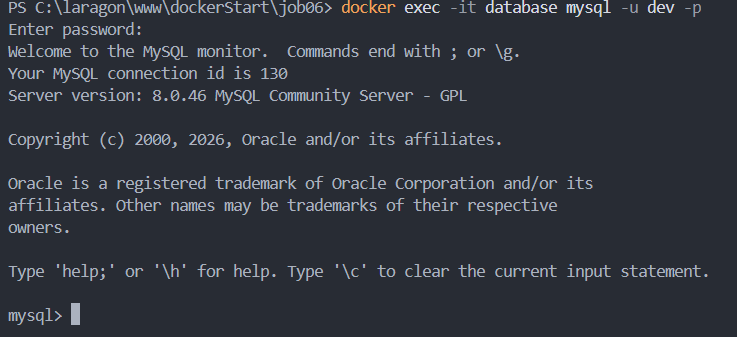

Action realisee : controle du conteneur MySQL depuis Docker ou depuis l'interface d'administration.

Cette etape sert a verifier que la base `projetdb` existe et que le service MySQL est bien initialise avec les variables d'environnement du compose.

### 10. Affichage du contenu de la base dans le terminal

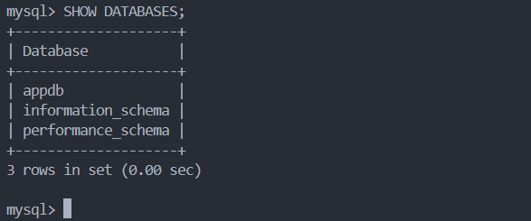

Commandes utilisees :

```bash
docker exec -it database mysql -u root -p
SHOW DATABASES;
```

Cette capture montre la consultation de MySQL depuis le terminal. Elle permet de valider la presence de la base de donnees et de naviguer dans son contenu.

### 11. Sortie de la session MySQL

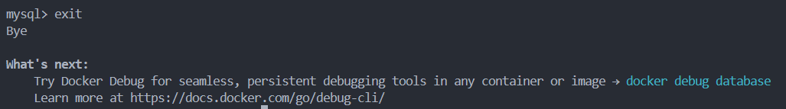

Commande utilisee :

```sql
exit
```

Cette derniere etape ferme proprement la console MySQL apres les verifications.

## Recapitulatif des commandes utiles

```bash
npm init -y
npm install
docker compose up --build -d
docker ps
docker exec -it database mysql -u root -p
curl http://localhost:3000/api/status
```


