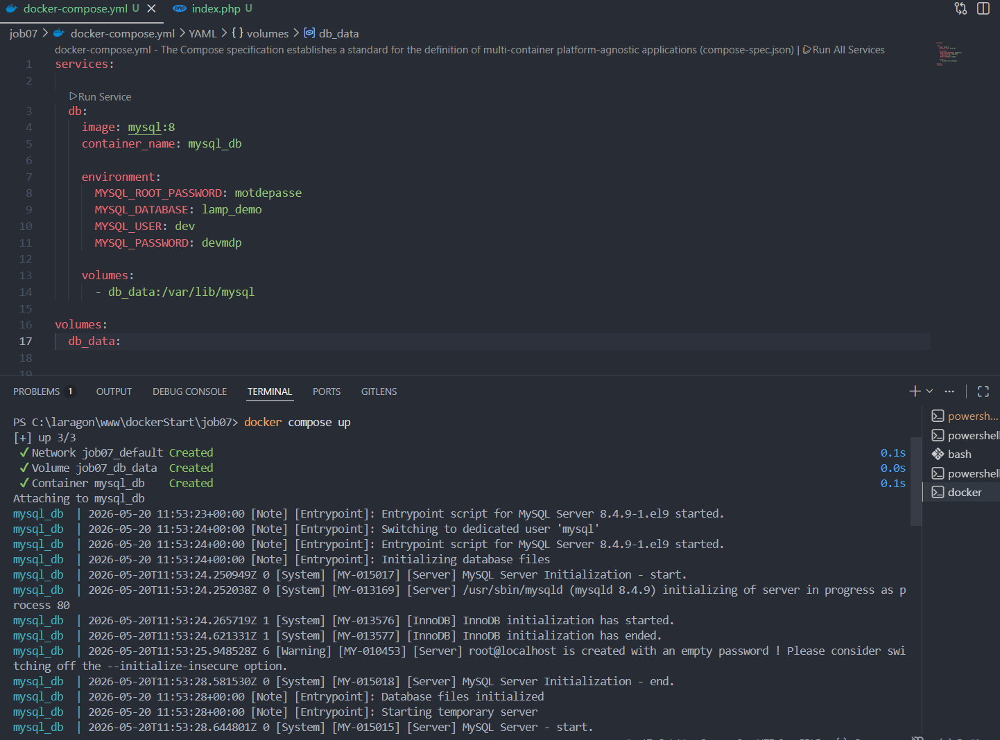
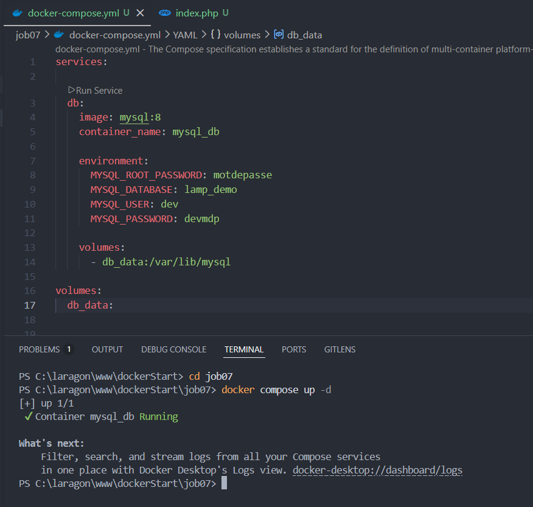
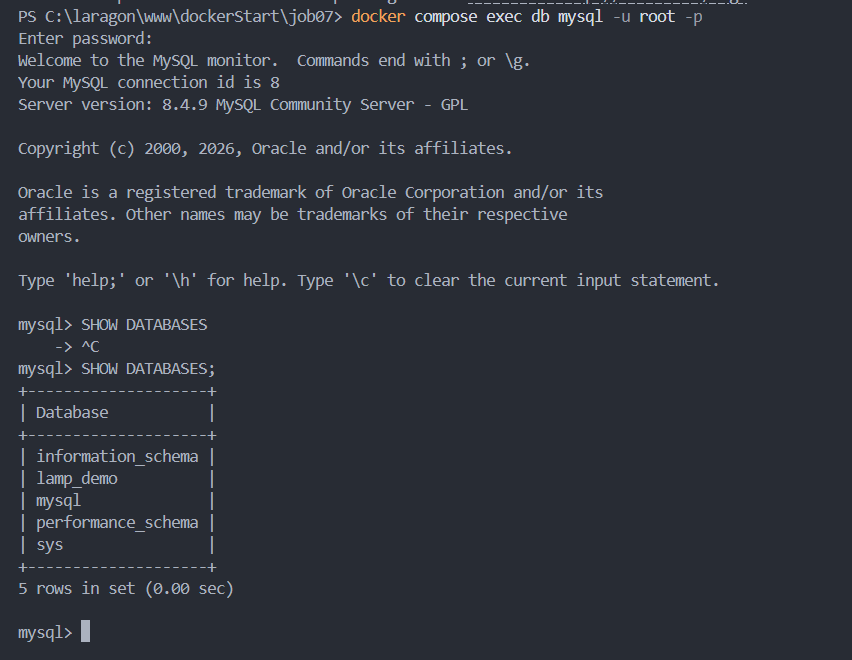
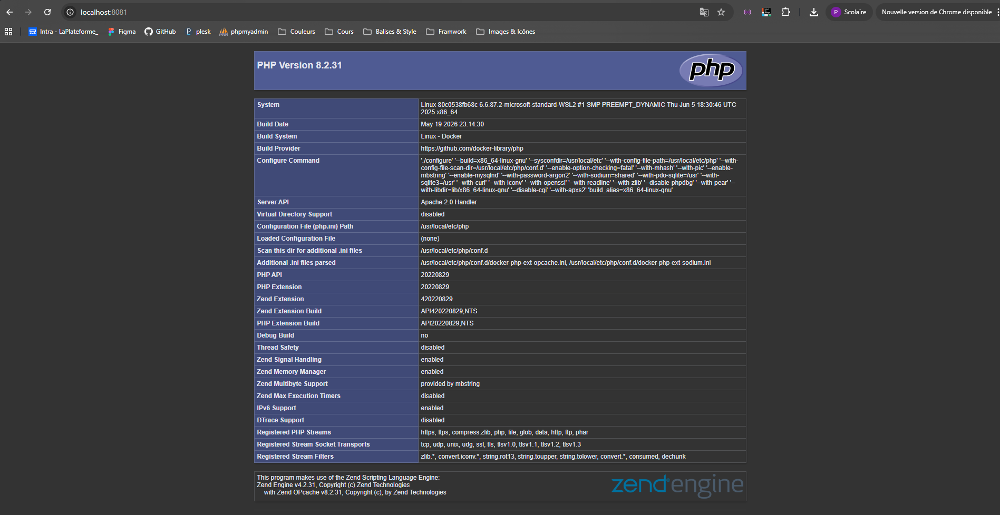
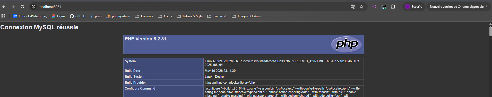
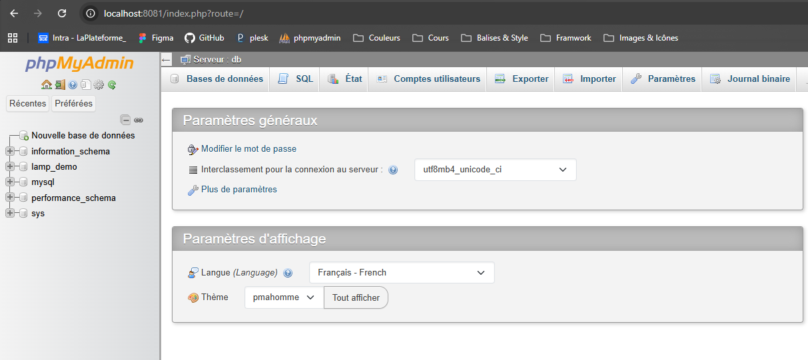
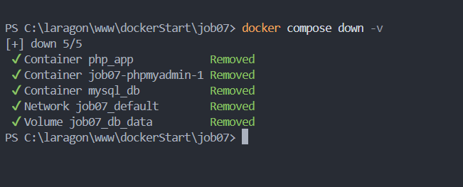

# job07 — LAMP avec Docker Compose

Ce dossier montre le déploiement d'un petit environnement LAMP avec Docker Compose. Les captures d'écran sont placées dans `src/img` et affichées ci-dessous dans l'ordre.

1) Création du service base de données

```bash
docker compose up -d db
```



2) Démarrage complet des services

```bash
docker compose up -d
```



3) Vérification des services (état / affichage)

```bash
docker compose ps
# ou
docker compose show
```



4) Accès à l'application / phpMyAdmin

Ouvrir dans le navigateur : `http://localhost:8081` (port exposé pour le service web)



5) Connexion à la base depuis PHP (exemple de page PHP reliant PDO)

La page `src/index.php` utilise les identifiants suivants :

```text
Host: db
Database: lamp_demo
User: dev
Password: devmdp
```



6) Interface phpMyAdmin (si configurée)

Identifiants possibles :

```text
Utilisateur: dev / devmdp
ou
Utilisateur: root / motdepasse
```



7) Arrêt et nettoyage

```bash
docker compose down
```



Remarques
- Si la connexion PHP retourne "could not find driver", il faut installer l'extension `pdo_mysql` dans l'image PHP (via un `Dockerfile` ou une image qui l'inclut).
- Attention aux conflits de ports : ne pas exposer plusieurs services sur le même port hôte.

