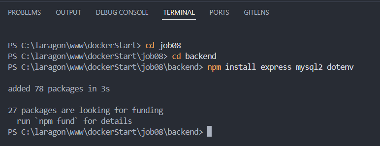
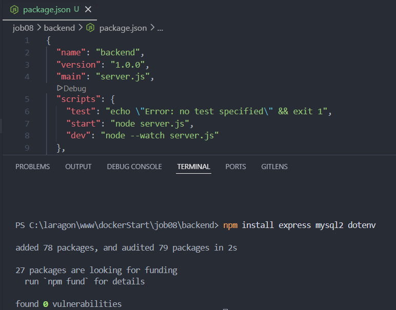
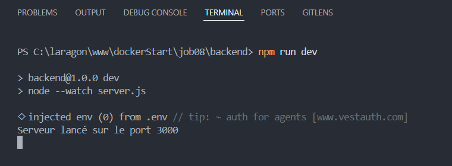
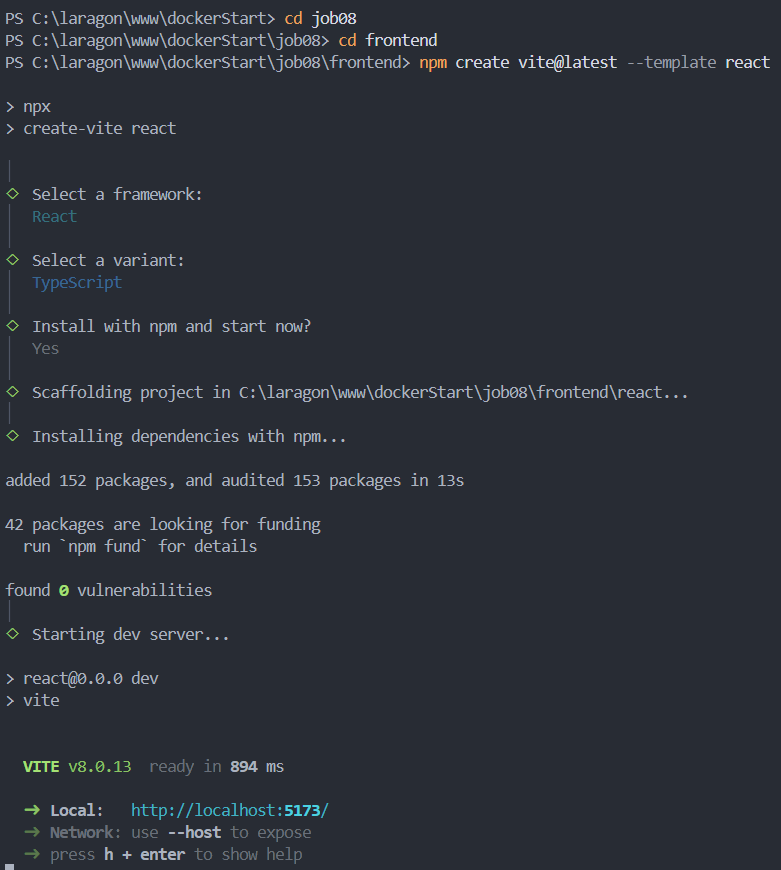
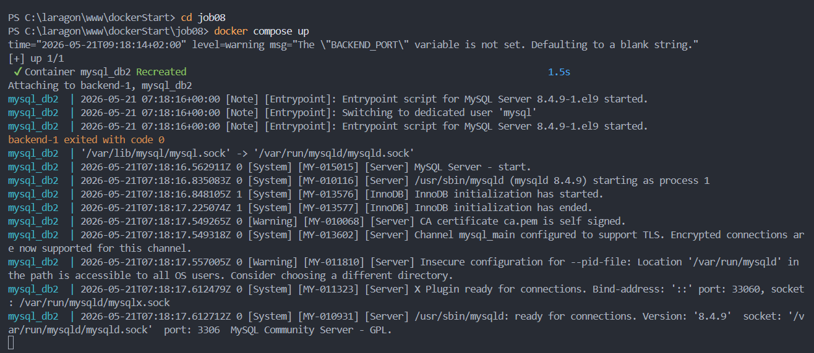
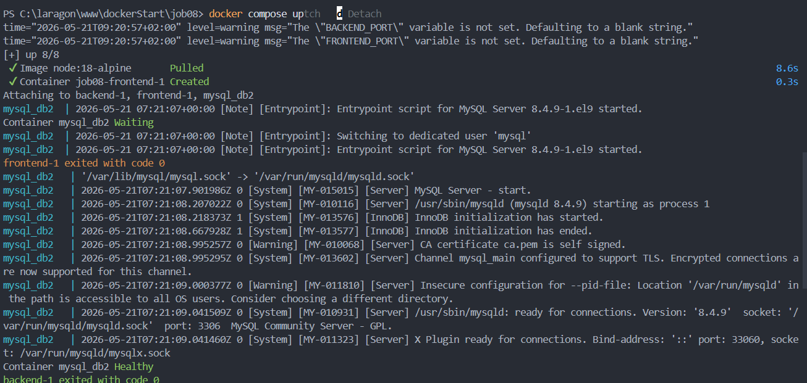
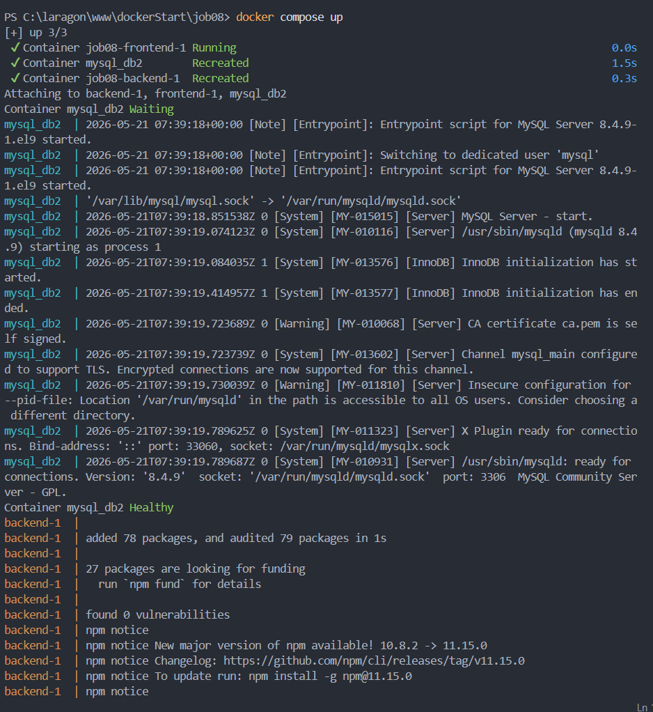
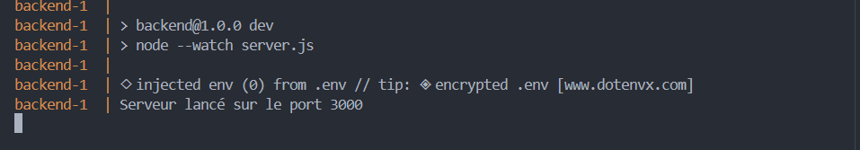
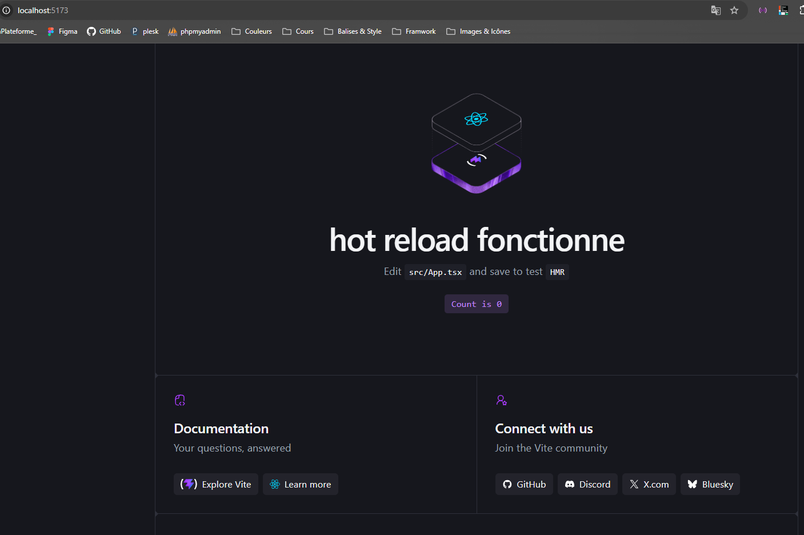

# Job08 — Frontend + Backend avec Docker Compose

Ce projet contient une application front-end (Vite + React) et un back-end Node.js (Express) orchestrés avec `docker-compose`.

## Contenu du dépôt
- `backend/` : serveur Node.js (`server.js`).
- `frontend/react/` : application React (Vite + TypeScript).
- `docker-compose.yml` : orchestration des services (MySQL, backend, frontend).

## Prérequis
- Docker et Docker Compose installés
- (Optionnel pour développement local) Node.js >= 18 et `npm`

## Installation et exécution (développement)

1) Backend (local)

```bash
cd backend
npm install
# lancer en mode dev (redémarrage automatique)
npm run dev
```

2) Frontend (local)

```bash
cd frontend/react
npm install
# lancer le serveur Vite 
npm run dev 
```

3) Exécution via Docker Compose 

```bash
# démarrer les services (en avant-plan)
docker-compose up

# démarrer en arrière-plan (détaché) et forcer la reconstruction si nécessaire
docker-compose up --build -d

# suivre les logs
docker-compose logs -f

# arrêter et supprimer les conteneurs
docker-compose down
```

4) Commandes utiles Docker

```bash
docker ps
docker-compose ps
docker-compose exec backend sh
```

## Variables d'environnement
Le fichier `.env` à la racine contient les variables MySQL et ports exposés. Consultez `.env.example` pour le modèle.

## Captures d'écran

Installation backend



`package.json` frontend



Lancement `npm run dev`



Installation frontend



`docker-compose up`



Service healthy



Tests hot-reload (1)



Tests hot-reload (2)



Hot-reload dans le navigateur




