# Job 01 - Docker Hello-World

## Exemples de commandes de suppression

- **Un conteneur spécifique**  
    `docker rm nom_container`

- **Plusieurs conteneurs**  
    `docker rm container1 container2`

- **Tous les conteneurs arrêtés**  
    `docker rm nom_du_container`

- **Forcer la suppression d'un conteneur actif**  
    `docker rm -f nom_container`

- **Une image spécifique**  
    `docker rmi nom_image`

- **Plusieurs images**  
    `docker rmi image1 image2`

- **Toutes les images utilisées**  
    `docker image prune -a`

- **Toutes les images non utilisées**  
    *(à compléter)*

- **Quelle erreur est présente dans les commandes ci-dessus (`docker images`) ? Donner la correction :**  
    *(à compléter)*

## Captures

### Installation de Docker
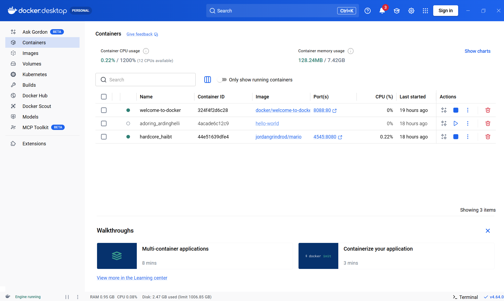

### Hello World Docker
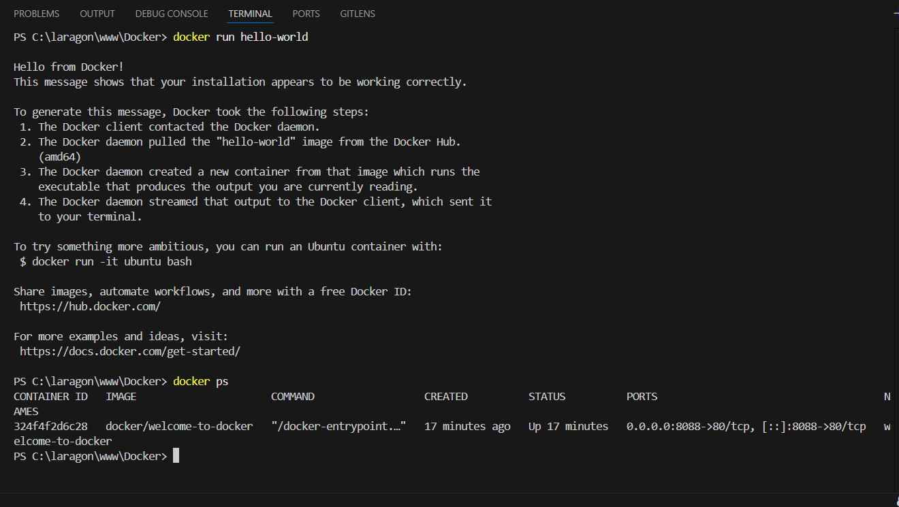

# Job02 - Mario

### Lignes de commande Mario
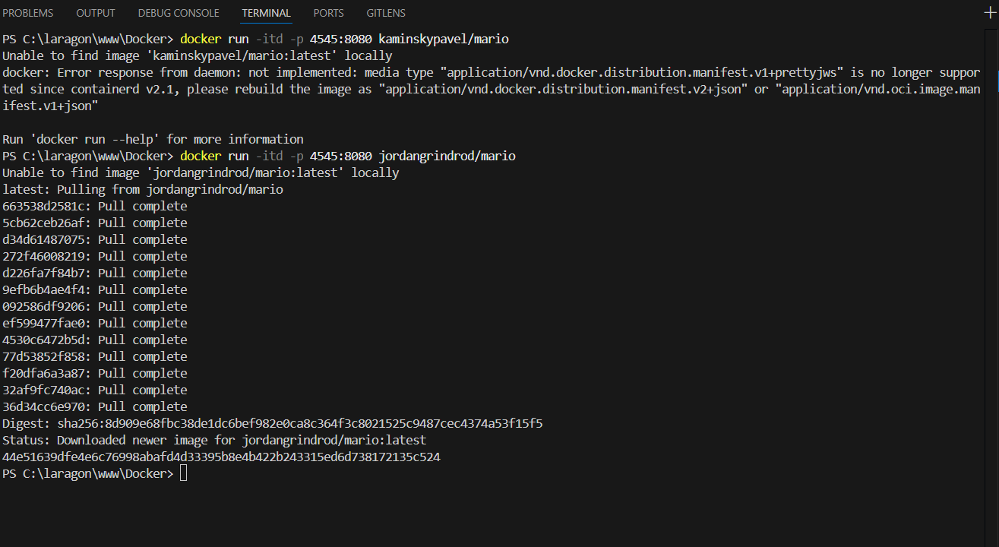

### Jeu Mario
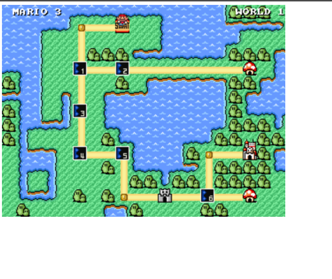

# Job 03 - Server NGINX

### Image 1 - Serveur NGINX
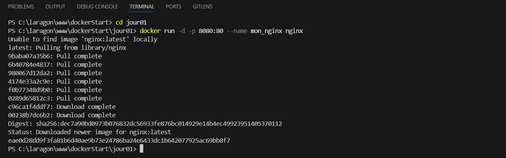
Légende : Lancement du serveur NGINX dans Docker.

### Image 2 - NGINX dans le navigateur
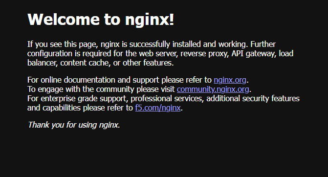
Légende : Vérification de NGINX dans le navigateur.

### Image 3 - Entrer dans Docker
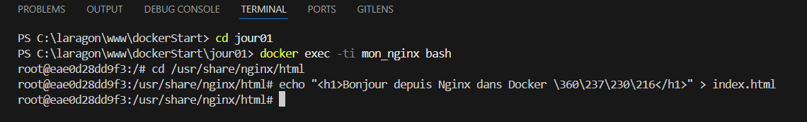
Légende : Accès au conteneur Docker en ligne de commande.

### Image 4 - Modifier le site
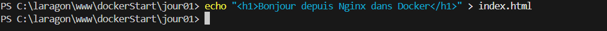
Légende : Modification des fichiers du site dans le conteneur.

### Image 5 - Site modifié dans le navigateur
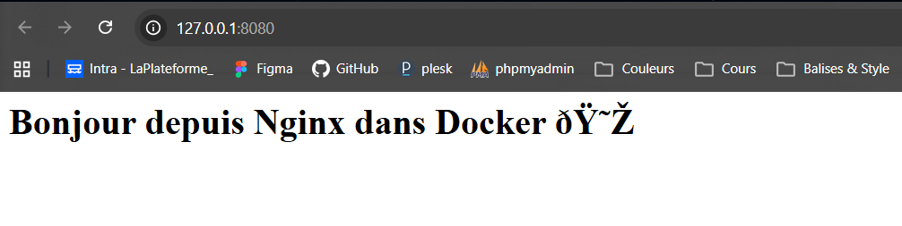
Légende : Résultat des modifications visibles dans le navigateur.

### Image 6 - Arrêt de NGINX
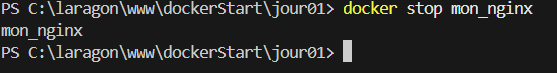
Légende : Arrêt du conteneur NGINX.

### Image 7 - Suppression de NGINX
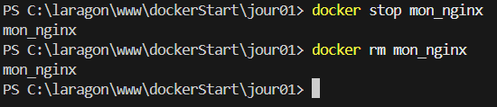
Légende : Suppression du conteneur NGINX.

