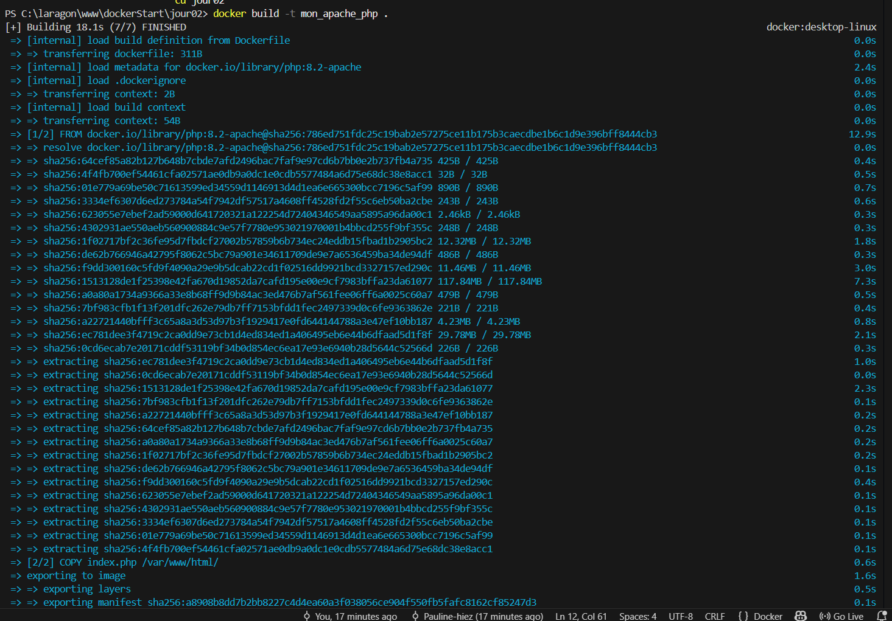
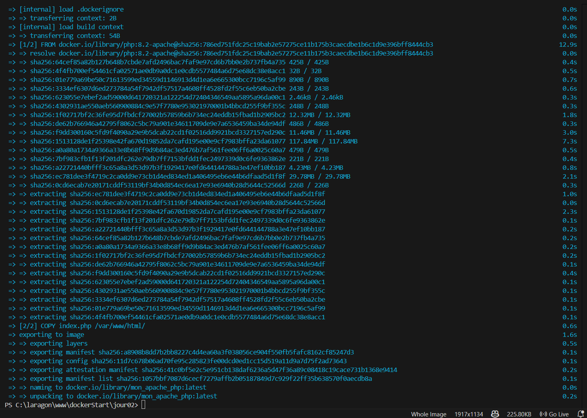
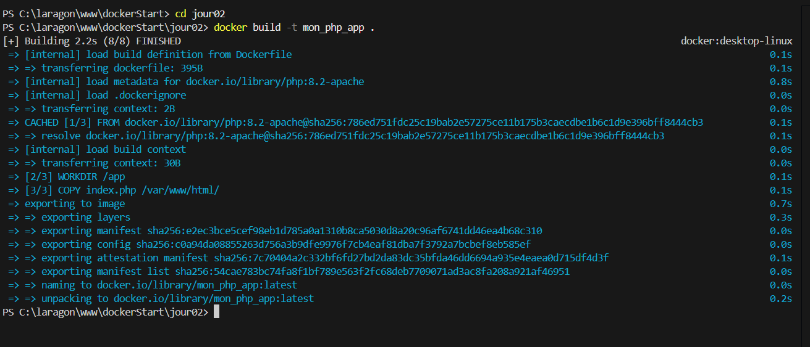
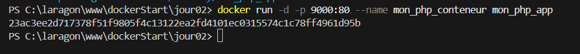
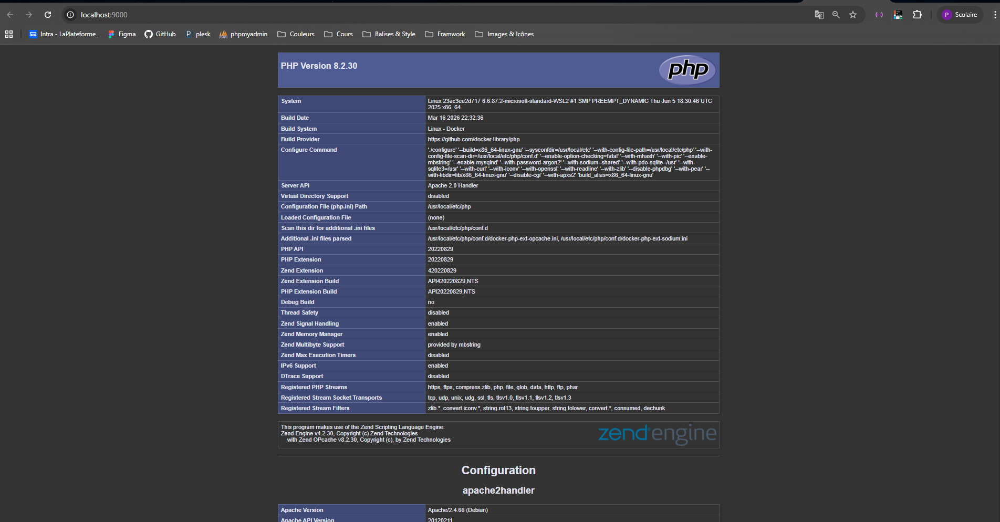

# Jour 02 — Dockeriser une application PHP

## Objectif
Créer une image Docker basée sur `php:8.2-apache`, lancer un conteneur web PHP, puis vérifier l'affichage dans le navigateur.

## Fichiers du projet
- `Dockerfile`
- `index.php`

## 1) Construire l'image Docker
Commande utilisée :

```bash
docker build -t mon_php_app .
```

Détail :
- `docker build` : construit une image à partir du `Dockerfile`.
- `-t mon_php_app` : donne le nom `mon_php_app` à l'image.
- `.` : indique que le contexte de build est le dossier courant (`jour02`).

### Capture — Build de l'image

Annotation : on voit la construction de l'image PHP/Apache et sa création avec le tag `mon_php_app`.

## 2) Lancer le conteneur
Commande utilisée :

```bash
docker run -d -p 9000:80 --name mon_php_conteneur mon_php_app
```

Détail :
- `docker run` : crée et démarre un conteneur.
- `-d` : exécution en arrière-plan.
- `-p 9000:80` : mappe le port local `9000` vers le port `80` du conteneur.
- `--name mon_php_conteneur` : nom du conteneur.
- `mon_php_app` : image utilisée.

### Capture — Lancement du conteneur

Annotation : la sortie terminal confirme la création du conteneur et affiche son identifiant.

## 3) Vérifier le conteneur en cours d'exécution
Commande utilisée :

```bash
docker ps
```

Détail :
- Affiche les conteneurs actifs.
- Permet de vérifier le nom, l'image et les ports exposés.

### Capture — Vérification via Docker

Annotation : on confirme que `mon_php_conteneur` est actif et que le port est bien publié.

## 4) Tester dans le navigateur
URL testée :

```text
http://localhost:9000
```

Détail :
- Apache sert `index.php` depuis `/var/www/html/`.
- Avec `phpinfo();`, la page affiche les informations PHP du conteneur.

### Capture — Résultat navigateur (1)

Annotation : la page PHP s'affiche correctement, ce qui valide le mapping de port et le serveur Apache.

### Capture — Résultat navigateur (2)

Annotation : seconde vérification visuelle du rendu de l'application dans le navigateur.

## 5) Commandes utiles de gestion

Arrêter le conteneur :

```bash
docker stop mon_php_conteneur
```

Supprimer le conteneur :

```bash
docker rm -f mon_php_conteneur
```

Supprimer l'image :

```bash
docker rmi mon_php_app
```

## Dépannage rapide
- Erreur `port is already allocated` : choisir un autre port hôte (ex. `9000:80`) ou libérer le port déjà utilisé.
- Erreur `container name is already in use` : supprimer l'ancien conteneur avec `docker rm -f mon_php_conteneur`.